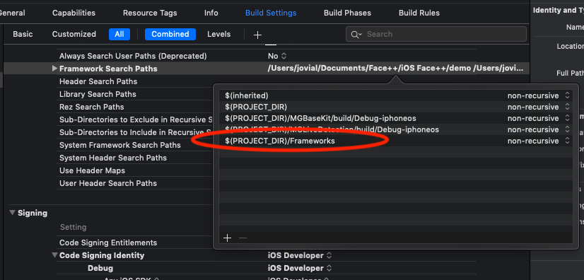

# <a name="XenchainSDK"></a> Xenchain - iOS
Docs version: 1.1.1<br>
Last updated: June 10, 2019

Xenchain SDK for iOS is SDK that allows the use of ID Scanning Features and Face Match capabilities into Android Applications. This version is an overhaul to existing [Xenchain SDK for iOS Platform](https://github.com/XenchainIO/xenchain_ios_framework), featuring improvement of Performance and ease of integration in comparison to older version.

## <a name="Authors"></a> Authors
Jovial Tan (jovial.tan@xenchain.io)<br>

## <a name="Revision"></a> Revision History

<table style="width:100%;">
    <tr>
        <th>Version</th>
        <th width=140>Author</th>
        <th width=120>Date</th>
        <th>Description</th>
    </tr>
    <tr>
        <td valign="top">1.1.0</td>
        <td valign="top" style="white-space: nowrap;">Jovial</td>
        <td valign="top" style="white-space: nowrap;">2019-05-17</td>
        <td valign="top">
            <ul>
                <li> Overhaul Xenchain SDK for better Performance and Ease of Integration. </li>
                <li> Change `ScanType` to `CardConfig` for ease of Scanning Configuration. </li>
                <li> Updated SDK with on-premise solution. </li>
                <li> Change `completeScanDeployment` to include the on-premise solution. </li>
                <li> Change MyKad Address Regex Issue to Raw OCR instead. </li>
                <li> Added Save Face results for on-premise solution. </li>
                <li> Modified `initSDK` function to include on-premise capability. </li>
                <li> Improve OCR Scanning Performance. </li>
                <li> Added additional callback function for `XenchainScannerCallback`. </li>
            </ul>
        </td>
        <td valign="top">1.1.1</td>
        <td valign="top" style="white-space: nowrap;">Jovial</td>
        <td valign="top" style="white-space: nowrap;">2019-06-10</td>
        <td valign="top">
            <ul>
                <li> Fixed missing image during the Landmark Checking. </li>
                <li> Fixed the Gender value missing for MyKad Default Scanning. </li>
                <li> Updated documentation for library not loaded issue. </li>
            </ul>
        </td>
    </tr>
<table>

## <a name="FeatureList"></a> Feature List
| Feature List                                          |
|-------------------------------------------------------|
| • ID Card Reader                                      |
| • ID Card Verification                                |
| • Passport NFC Verification (Coming Soon)             |
| • Face Verification                                   |
| • Video Recording for Face Verification (Coming Soon) |

### <a name="AddSDK"></a> Adding SDK into project
Kindly note that the project requires the use of a real physical iOS Device in order for the SDK to compile and work properly. Otherwise, will result in either compilation error or no access to the camera.<br>
*Step 1*: Download XenchainSDK.framework file. Please note that you are required to use **Git LFS** to download the Frameworks folder. Otherwise, manually download the [XenchainSDK](Frameworks/XenchainSDK.framework/XenchainSDK) and [Microblink](Frameworks/MicroBlink.framework/MicroBlink) files and replace them respectively as shown below. **Failure to do so will results in App Crash during the `InitSDK` process.** <br>


<br/>


<br/>

*Step 2*: On your project import additional frameworks and libraries in the "Linked frameworks and libraries" section of your target settings
1. libc++.tbd
2. libz.tbd
3. libiconv.tbd
4. AudioToolbox.framework
5. AVFoundation
6. CoreMedia.framework

*Step 2*: Import the .framework file into your project
1. Open the project navigator
2. Drag the XenchainSDK.framework to your project Framework group folder
3. Drag the MicroBlink.framework to your project Framework group folder
4. In your target settings, add XenchainSDK.framework and MicroBlink.framework into "Embedded Binaries" section. If any, remove any duplicates of XenchainSDK.framework and MicroBlink.framework from the "Linked Frameworks and Libraries" section.

## <a name="InitialSetup"></a> Initial Setup
### <a name="ProjectTargetSettings"></a> Project Target Settings Setup
#### <a name="BuildSettingsSetup"></a> Build Settings Setup
Please follow the red oval below to setup for the frameworks which is crucial for scanning ID cards.<br>


#### <a name="InfoPlistSetup"></a> Info.plist Setup
Kindly add the below configuration setup to allow iOS to bypass the HTTPS checking for Xenchain URL. In addition, please setup Privacy – Camera Usage Description and Privacy – Photo Library Usage Description. Please note that the contents of these Privacy can be anything. Finally, the key for `apiurl` must be replaced and will be provided by Xenchain.
```xml
<key>NSAppTransportSecurity</key>
<dict>
    <key>NSExceptionDomains</key>
    <dict>
        <key>apiurl</key>
        <dict>
            <key>NSExceptionAllowsInsecureHTTPLoads</key>
            <true/>
            <key>NSIncludesSubdomains</key>
            <true/>
        </dict>
    </dict>
</dict>
<key>NSCameraUsageDescription</key>
<string>Capture Face Image of the User for Face Match Feature</string>
<key>NSPhotoLibraryUsageDescription</key>
<string>Upload Image of the User for App Features</string>
```

#### <a name="BuildPhaseSetup"></a> Build Phase Setup
<br>
Kindly add the script configuration below to remove all the Device Architecture from the Framework as shown in the image above. Please add the script on the very last of the Build Phase. Failure to do so might result in rejection when upload to the Apple Store.
```javascript
APP_PATH="${TARGET_BUILD_DIR}/${WRAPPER_NAME}"

# This script loops through the frameworks embedded in the application and

# removes unused architectures.
find "$APP_PATH" -name '*.framework' -type d | while read -r
FRAMEWORK
do
FRAMEWORK_EXECUTABLE_NAME=$(defaults read "$FRAMEWORK/Info.plist" CFBundleExecutable)
FRAMEWORK_EXECUTABLE_PATH="$FRAMEWORK/$FRAMEWORK_EXECUTABLE_NAME"
echo "Executable is $FRAMEWORK_EXECUTABLE_PATH"
EXTRACTED_ARCHS=()
for ARCH in $ARCHS
do
echo "Extracting $ARCH from $FRAMEWORK_EXECUTABLE_NAME"

lipo -extract "$ARCH" "$FRAMEWORK_EXECUTABLE_PATH" -o "$FRAMEWORK_EXECUTABLE_PATH-$ARCH"

EXTRACTED_ARCHS+=("$FRAMEWORK_EXECUTABLE_PATH-$ARCH")
done
echo "Merging extracted architectures: ${ARCHS}"

lipo -o "$FRAMEWORK_EXECUTABLE_PATH-merged" -create "${EXTRACTED_ARCHS[@]}"

rm "${EXTRACTED_ARCHS[@]}"
echo "Replacing original executable with thinned version"
rm "$FRAMEWORK_EXECUTABLE_PATH"
mv "$FRAMEWORK_EXECUTABLE_PATH-merged" "$FRAMEWORK_EXECUTABLE_PATH"
done
```

### <a name="ImportSDK"></a> Import SDK classes
```swift
// For Swift Implementation
import XenchainSDK;
```
```objectivec
// For Objective-C Implementation
#import <XenchainSDK/XenchainSDK.h>;
```

### <a name="InitXenchainSDK"></a> Initialize Xenchain SDK
Please ensure that you execute the below code first before proceeding to other features of the SDK.
```swift
// For Swift Implementation
XenchainSDK.initSDK("SampleAPIKey", apiURL: "SampleAPIURL", onPremSaveData: false, completionHandler: XenchainSDKCallback)
```
```objectivec
// For Objective-C Implementation
[XenchainSDK InitSDK:@"SampleAPIKey" apiURL:@"SampleAPIURL" onPremSaveData:false completionHandler:XenchainSDKCallback];
```
| Parameter         | Description |
|-------------------|-------------|
| apiKey            | API Key for activating SDK Features. |
| apiURL            | URL Server Address which can be configured to point another server should client request private server. The value of this parameter will need to be requested from Xenchain Admin.     |
| onPremSaveData    | Determines whether the data returned from SDK will be saved into on-premise server. Only applicable if the client decided to host the backend server into client's own server. |
| completionHandler | Callback function for returning the results of `initSDK` function. Refer to  |

### <a name="XenchainSDKCallback"></a> XenchainSDKCallback callback functions
```swift
// For Swift Implementation
func initSDKStatus(_ status: Bool, message: String!)
```
```objectivec
// For Objective-C Implementation
- (void)InitSDKStatus:(bool)status message:(NSString *)message;
```
<b>Description:</b>
Callback function that is used to determine the status of the Initialization of XenchainSDK<br>
<b>Parameters:</b>
* status : Determines whether the SDK can be used or not.
* message : Contains the error message if the SDK cannot be initialized.

## <a name="SDKConfiguration"></a> Additional SDK configuration
#### <a name="ScanningSound"></a> Custom Scanning Sound
```swift
// For Swift Implementation
XenchainSDK.setScanningSound(Bundle(identifier: "com.example.reader")!.bundlePath + "/example_sound.mp3")
```
```objectivec
// For Objective-C Implementation
XenchainSDK.scanningSound = [[NSBundle bundleWithIdentifier:@"com.example.reader"].bundlePath stringByAppendingString:@"/example_sound.mp3"]
```
Kindly note that the input must be in String Path format.

#### <a name="LoadingDialogImage"></a> Loading Dialog Image
```swift
// For Swift Implementation
XenchainSDK.setLoadingLogo(UIImage())
```
```objectivec
// For Objective-C Implementation
XenchainSDK.loadingLogo = [[UIImage alloc] init];
```
Kindly note the input must be in UIImage based format.

#### <a name="CustomLoadingDialog"></a> Custom Loading Dialog
```swift
// For Swift Implementation
XenchainSDK.setLoadingView(UIView())
```
```objectivec
// For Objective-C Implementation
XenchainSDK.loadingView = [[UIView alloc] init];
```
Kindly note the input must be in `UIView` Data Type format.

## <a name="ImplementationIDCardReader"></a> Implementation of ID Card Reader
### <a name="ScannerViewController"></a> Implementation of Custom Scanner ViewController
Before proceed calling the `deployScanner` function, the app must have an Extended `XScannerViewController` class, in which the extended class will be used to Scan ID Card. The minimum implementation of the Extended `XScannerViewController` class is shown below.
```swift
/** Sample Swift Class of Extended XScannerViewController */
class CameraViewController: XScannerViewController {
    override func viewDidLoad() {
      super.viewDidLoad()
    }

    override func startScanHologram() {
      print("Start Scan Hologram")
    }

    override func setHologramProgress(_ progress: Double) {
      print("Hologram Progress")
    }

    override func hasScanHologram() {
      print("Has Scan Hologram")
    }

    override func startScanFontSize() {
      print("Start Scan Font Size")
    }

    override func hasScanFontSize() {
      print("Has Scan Font Size")
    }

    override func startScanFront() {
      print("Start Scan Front")
    }

    override func hasScanFront(_ frontImage: UIImage) {
      print("Has Scan Front")
    }

    override func startScanBack() {
      print("Start Scan Back")
    }

    override func hasScanBack(_ backImage: UIImage) {
      print("Has Scan Back")
    }
}
```
```objectivec
/** Sample Objective-C Class of Extended XScannerViewController */
@interface CameraViewController : XScannerViewController

@end

@implementation CameraViewController
    - (void)viewDidLoad {
      [super viewDidLoad];
    }

    - (void)startScanHologram {
      NSLog(@"Start Scan Hologram");
    }

    - (void)setHologramProgress:(double)progress {
      NSLog(@"Hologram Progress");
    }

    - (void)hasScanHologram {
      NSLog(@"Has Scan Hologram");
    }

    - (void)startScanFontSize {
      NSLog(@"Start Scan Font Size");
    }

    - (void)hasScanFontSize {
      NSLog(@"Has Scan Font Size");
    }

    - (void)startScanFront {
      NSLog(@"Start Scan Front");
    }

    - (void)hasScanFront:(UIImage *)frontImage {
      NSLog(@"Has Scan Front");
    }

    - (void)startScanBack() {
      NSLog(@"Start Scan Back");
    }

    - (void)hasScanBack:(UIImage *)backImage {
      NSLog(@"Has Scan Back");
    }
@end
```

### <a name="StartScanID"></a> Start Scan ID CARD
```swift
// For Swift Implementation
XenchainSDK.deployScanner(scanConfig, inputController: self, extendedController: self.storyboard!.instantiateViewController(withIdentifier: "CameraViewController"), completionHandler: self)
```
```objectivec
// For Objective-C Implementation
[XenchainSDK DeployScanner:scanConfig inputController:self extendedController:[self.storyboard instantiateViewControllerWithIdentifier:@"CameraViewController"] completionHandler:self];
```
| Parameter          | Description |
|--------------------|-------------|
| scanConfig         | Scan Configuration, which must be configured at App level, that determines the scanning behavior. Refer to [Scanning Configuration](#ScanningConfiguration) for list of available configuration. |
| inputController    | ViewController class that is used to call the scanner. |
| extendedController | The extended `XScannerViewController` class that is used as overlay for the Camera ViewController. |
| completionHandler  | Callback function for ID Scanning. |

Kindly note that the below code is required to be executed after `scanResults` function being called. Otherwise, for each scanning, the SDK will charged the scan.
```swift
// For Swift Implementation
XenchainSDK.completeScanDeployment(onBoardingID, cardFrontReferenceID: mRefFrontImage, faceReferenceID: mRefFaceImage, cardBackReferenceID: mRefBackImage, cardResult: cardResult, completionHandler: self)
```
```objectivec
// For Objective-C Implementation
[XenchainSDK CompleteScanDeployment:onBoardingID cardFrontReferenceID:mRefFrontImage faceReferenceID:mRefFaceImage cardBackReferenceID:mRefBackImage cardResult:cardResult completionHandler:self];
```
| Parameter            | Description                                                           |
|----------------------|-----------------------------------------------------------------------|
| onBoardingID         | The Overall Transaction ID for the whole Onboarding Process.          |
| cardFrontReferenceID | The reference ID of the `refFrontID` from `scanMetaResults` function. |
| faceReferenceID      | The reference ID of the `refFace` from `scanMetaResults` function.    |
| cardBackReferenceID  | The reference ID of the `refBackID` from `scanMetaResults` function.  |
| completionHandler    | Callback function for ID Scanning.                                    |

### <a name="XenchainScannerCallback"></a> XenchainScannerCallback callback functions
---
```swift
// For Swift Implementation
func scanResults(_ cardResult: XCardResult!, onBoardingID: String!, errorMessage: String!)
```
```objectivec
// For Objective-C Implementation
- (void)ScanResults:(XCardResult *)cardResult onBoardingID:(NSString *)onBoardingID errorMessage:(NSString *)errorMessage;
```
<b>Description:</b>
Callback function that provides Scanning Results from ID Scanning Process<br>
<b>Parameters:</b>
* cardResult : Result card info from the reader.
* onBoardingID : The Overal Transaction ID for the whole Onboarding Process.
* errorMessage : Error passed from processing ID Card result.
---
```swift
// For Swift Implementation
func scanMetaResults(_ idFaceImage: UIImage!, refFace: String!, idFrontImage: UIImage!, refFrontID: String!, idBack idBackImage: UIImage!, refBackID: String!, errorMessage: String!)
```
```objectivec
// For Objective-C Implementation
- (void)ScanMetaResults:(UIImage *)idFaceImage refFace:(NSString *)refFace idFrontImage:(UIImage *)idFrontImage refFrontID:(NSString *)refFrontID idBackImage:(UIImage *)idBackImage refBackID:(NSString *)refBackID errorMessage:(NSString *)errorMessage;
```
<b>Description:</b>
Callback function that provides Meta Scan Results from ID Scanning Process<br>
<b>Parameters:</b>
* idFaceBitmap : Refers to Cropped Face Image from ID Card Image.
* refFace : The reference ID of the Cropped Face Image.
* idFrontBitmap : The ID Card Image from ID Scanner.
* refFrontID : The reference ID of the ID Card Image.
* idBackBitmap : The Back ID Card Image from ID Scanner.
* refBackID : The reference ID of the Back ID Card Image.
* errorMessage : Error passed from processing ID Card result.
---
```swift
// For Swift Implementation
func scanLandmarkInformation(_ landmarkScores: [AnyHashable : Any]!)
```
```objectivec
// For Objective-C Implementation
- (void)ScanLandmarkInformation:(NSDictionary *)landmarkScores;
```
<b>Description:</b>
Callback function that provides the Landmark Scores of the ID Cards. Used to determine the legitimacy of the ID Card.<br>
<b>Parameters:</b>
* landmarkScores : The landmark scores for each field that is captured by the ID Scanner.
---
```swift
// For Swift Implementation
func scanServiceReferenceID(_ serviceReferenceID: String!, errorMessage: String!)
```
```objectivec
// For Objective-C Implementation
- (void)ScanServiceReferenceID:(NSString *)serviceReferenceID errorMessage:(NSString *)errorMessage;
```
<b>Description:</b>
Callback function that is called for each OCR Scanning.<br>
<b>Parameters:</b>
* serviceReferenceID : Billing reference is returned if all the important attributes of the ID Card are returned successfully during the scanning process.
* errorMessage : Error passed from processing ID Card result.
---
```swift
// For Swift Implementation
func scanCompleteDeployment(_ status: Bool, errorMessage: String!)
```
```objectivec
// For Objective-C Implementation
-(void) ScanCompleteDeployment:(bool)status errorMessage:(NSString *)errorMessage;
```
<b>Description:</b>
Callback function that is called when the Scanning has been charged completely.<br>
<b>Parameters:</b>
* status : Represents whether the `completeScanDeployment` is successfully called or not.
* errorMessage : Error passed from processing `completeScanDeployment`.

### <a name="ScanningConfiguration"></a> Scanning Configuration
The behavior of scanning must be configured through the implementation of the class below. Each of the class represents each each countries that are supported by the SDK.

| Scan Config Class | Description                                  |
|-------------------|----------------------------------------------|
| MyKadConfig       | MyKad Scanning Configuration                 |
| PassportConfig    | Passport Scanning Configuration              |

### <a name="XCardResult"></a> Class XCardResult Details
Kindly note that depending on the type of ID Card being scanned and/or the information contained in the MRZ (Machine Readable Zone), each of the function represented below may be null/empty.
```swift
// For Swift Implementation
var mDocumentType: String
var mDocumentNumber: String
var mCardNumber: String
var mArmyNumber: String
var mBackDocumentNumber: String

var mFrontName: String
var mBackName: String

var mBloodType: String

var mAddress: String
var mVillage: String
var mRTRW: String
var mDistrict: String
var mCity: String
var mProvince: String

var mReligion: String
var mStatus: String
var mJob: String
var mGender: String

var mCitizenship: String
var mNationality: String
var mRace: String

var mPlaceOfBirth: String
var mDateOfBirth: String
var mCountryOfBirth: String
var mFrontDateIssued: String
var mBackDateIssued: String
var mDateUpdated: String
var mFrontExpiry: String
var mBackExpiry: String

var mChipNumber: String
var mSerialNumber: String

var mEmployerInfo: String
var mSector: String
var mEmploymentOccupation: String
var mDateOfApplication: String
var mForeignIdentificationNo: String

var mFacultyInfo: String
var mFacultyCityZipcodeState: String
var mFacultyAddress: String

func toString() -> String!
```
```objectivec
// For Objective-C Implementation
@property (nonatomic, strong) NSString* mDocumentType;
@property (nonatomic, strong) NSString* mDocumentNumber;
@property (nonatomic, strong) NSString* mCardNumber;
@property (nonatomic, strong) NSString* mArmyNumber;
@property (nonatomic, strong) NSString* mBackDocumentNumber;

@property (nonatomic, strong) NSString* mFrontName;
@property (nonatomic, strong) NSString* mBackName;

@property (nonatomic, strong) NSString* mBloodType;

@property (nonatomic, strong) NSString* mAddress;
@property (nonatomic, strong) NSString* mVillage;
@property (nonatomic, strong) NSString* mRTRW;
@property (nonatomic, strong) NSString* mDistrict;
@property (nonatomic, strong) NSString* mCity;
@property (nonatomic, strong) NSString* mProvince;

@property (nonatomic, strong) NSString* mReligion;
@property (nonatomic, strong) NSString* mStatus;
@property (nonatomic, strong) NSString* mJob;
@property (nonatomic, strong) NSString* mGender;

@property (nonatomic, strong) NSString* mCitizenship;
@property (nonatomic, strong) NSString* mNationality;
@property (nonatomic, strong) NSString* mRace;

@property (nonatomic, strong) NSString* mPlaceOfBirth;
@property (nonatomic, strong) NSString* mDateOfBirth;
@property (nonatomic, strong) NSString* mCountryOfBirth;
@property (nonatomic, strong) NSString* mFrontDateIssued;
@property (nonatomic, strong) NSString* mBackDateIssued;
@property (nonatomic, strong) NSString* mDateUpdated;
@property (nonatomic, strong) NSString* mFrontExpiry;
@property (nonatomic, strong) NSString* mBackExpiry;

@property (nonatomic, strong) NSString* mChipNumber;
@property (nonatomic, strong) NSString* mSerialNumber;

@property (nonatomic, strong) NSString* mEmployerInfo;
@property (nonatomic, strong) NSString* mSector;
@property (nonatomic, strong) NSString* mEmploymentOccupation;
@property (nonatomic, strong) NSString* mDateOfApplication;
@property (nonatomic, strong) NSString* mForeignIdentificationNo;

@property (nonatomic, strong) NSString* mFacultyInfo;
@property (nonatomic, strong) NSString* mFacultyCityZipcodeState;
@property (nonatomic, strong) NSString* mFacultyAddress;

-(NSString *) toString;
```
---
```objectivec
@property (nonatomic, strong) NSString* mDocumentType;
```
<b>Description:</b><br>
Get document type from ID Card.

---
```objectivec
@property (nonatomic, strong) NSString* mDocumentNumber;
```
<b>Description:</b>
Get document ID Number from ID Card.

---
```objectivec
@property (nonatomic, strong) NSString* mCardNumber;
```
<b>Description:</b>
Get ID card Number for the Passport.

---
```objectivec
@property (nonatomic, strong) NSString* mArmyNumber;
```
<b>Description:</b>
Get Army Number from ID Card.

---
```objectivec
@property (nonatomic, strong) NSString* mBackDocumentNumber;
```
<b>Description:</b>
Get document ID Number from Back ID Card.

---
```objectivec
@property (nonatomic, strong) NSString* mFrontName;
```
<b>Description:</b>
Get Name from Front ID Card.

---
```objectivec
@property (nonatomic, strong) NSString* mBackName;
```
<b>Description:</b>
Get Name from Back ID Card.

---
```objectivec
@property (nonatomic, strong) NSString* mBloodType;
```
<b>Description:</b>
Get blood type from ID Card.

---
```objectivec
@property (nonatomic, strong) NSString* mAddress;
```
<b>Description:</b>
Get address from ID Card.

---
```objectivec
@property (nonatomic, strong) NSString* mVillage;
```
<b>Description:</b>
Get village from ID Card (Only in Indonesia eKTP).

---
```objectivec
@property (nonatomic, strong) NSString* mRTRW;
```
<b>Description:</b>
Get RT/RW from ID Card (Only in Indonesia eKTP).

---
```objectivec
@property (nonatomic, strong) NSString* mDistrict;
```
<b>Description:</b>
Get district from ID Card (Only in Indonesia eKTP).

---
```objectivec
@property (nonatomic, strong) NSString* mCity;
```
<b>Description:</b>
Get city from ID Card.

---
```objectivec
@property (nonatomic, strong) NSString* mProvince;
```
<b>Description:</b>
Get province from ID Card (Only in Indonesia eKTP).

---
```objectivec
@property (nonatomic, strong) NSString* mReligion;
```
<b>Description:</b>
Get religion status from ID Card.

---
```objectivec
@property (nonatomic, strong) NSString* mStatus;
```
<b>Description:</b>
Get marital status from ID Card.

---
```objectivec
@property (nonatomic, strong) NSString* mJob;
```
<b>Description:</b>
Get job from ID Card.

---
```objectivec
@property (nonatomic, strong) NSString* mGender;
```
<b>Description:</b>
Get gender from ID Card.

---
```objectivec
@property (nonatomic, strong) NSString* mCitizenship;
```
<b>Description:</b>
Get citizenship from ID Card.

---
```objectivec
@property (nonatomic, strong) NSString* mNationality;
```
<b>Description:</b>
Get nationality from ID Card.

---
```objectivec
@property (nonatomic, strong) NSString* mRace;
```
<b>Description:</b>
Get race from ID Card.

---
```objectivec
@property (nonatomic, strong) NSString* mPlaceOfBirth;
```
<b>Description:</b>
Get place of birth from ID Card.

---
```objectivec
@property (nonatomic, strong) NSString* mDateOfBirth;
```
<b>Description:</b>
Get date of birth from ID Card.

---
```objectivec
@property (nonatomic, strong) NSString* mCountryOfBirth;
```
<b>Description:</b>
Get country of birth from ID Card.

---
```objectivec
@property (nonatomic, strong) NSString* mFrontDateIssued;
```
<b>Description:</b>
Get date of issued from front ID Card.

---
```objectivec
@property (nonatomic, strong) NSString* mBackDateIssued;
```
<b>Description:</b>
Get date of issued from Back ID Card.

---
```objectivec
@property (nonatomic, strong) NSString* mDateUpdated;
```
<b>Description:</b>
Get date of updated from ID Card.

---
```objectivec
@property (nonatomic, strong) NSString* mFrontExpiry;
```
<b>Description:</b>
Get date of expiry from front ID Card.

---
```objectivec
@property (nonatomic, strong) NSString* mBackExpiry;
```
<b>Description:</b>
Get date of expiry from Back ID Card.

---
```objectivec
@property (nonatomic, strong) NSString* mChipNumber;
```
<b>Description:</b>
Get chip number from ID card.

---
```objectivec
@property (nonatomic, strong) NSString* mSerialNumber;
```
<b>Description:</b>
Get Serial Number from ID Card

---
```objectivec
@property (nonatomic, strong) NSString* mEmployerInfo;
```
<b>Description:</b>
Get Employer Info from ID Card (Only in Singapore PASS or Work Permit).

---
```objectivec
@property (nonatomic, strong) NSString* mSector;
```
<b>Description:</b>
Get Employer Sector from ID Card (Only in Singapore PASS or Work Permit).

---
```objectivec
@property (nonatomic, strong) NSString* mEmploymentOccupation;
```
<b>Description:</b>
Get Employment Occupation from ID Card (Only in Singapore PASS or Work Permit).

---
```objectivec
@property (nonatomic, strong) NSString* mDateOfApplication;
```
<b>Description:</b>
Get Date of Application from ID Card (Only in Singapore PASS or Work Permit).

---
```objectivec
@property (nonatomic, strong) NSString* mForeignIdentificationNo;
```
<b>Description:</b>
Get Foreign Identification No from ID Card (Only in Singapore PASS or Work Permit).

---
```objectivec
@property (nonatomic, strong) NSString* mFacultyInfo;
```
<b>Description:</b>
Get Faculty Information from ID Card (Only in Singapore PASS or Work Permit).

---
```objectivec
@property (nonatomic, strong) NSString* mFacultyCityZipcodeState;
```
<b>Description:</b>
Get Faculty City Zip Code State from ID Card (Only in Singapore PASS or Work Permit).

---
```objectivec
@property (nonatomic, strong) NSString* mFacultyAddress;
```
<b>Description:</b>
Get Faculty Address from ID Card (Only in Singapore PASS or Work Permit).

---
```objectivec
-(NSString *) toString;
```
<b>Description:</b>
Get JSON String format of this object.

## <a name="ImplementationFaceMatch"></a> Implementation Face Match feature
### <a name="StartFaceMatch"></a> Start Face Match Function
Kindly note that ID Scan Feature must be implemented first and executed before proceed to Face Match Feature.
```swift
// For Swift Implementation
XenchainSDK.deployFaceMatch(se;f, onBoardingID: mOnBoardingID, imageRef: mRefFaceImage, completionHandler: self)
```
```objectivec
// For Objective-C Implementation
[XenchainSDK DeployFaceMatch:self onBoardingID:mOnBoardingID imageRef:mRefFaceImage completionHandler:self];
```
| Parameter         | Description                                                        |
|-------------------|--------------------------------------------------------------------|
| onBoardingID      | Refers to the particular OnBoarding Transaction ID.                |
| imageRef          | The reference ID of the `refFace` from `scanMetaResults` function. |
| completionHandler | Callback function for Face Match Scanning.                         |

### <a name="XenchainFaceCallback"></a> XenchainFaceCallback callback functions
---
```swift
// For Swift Implementation
func faceMatchResult(_ isMatched: Bool, percentMatched: Double, serviceReferenceID: String!, error: String!)
```
```objectivec
// For Objective-C Implementation
- (void)FaceMatchResult:(bool)isMatched percentMatched:(double)percentMatched serviceReferenceID:(NSString *)serviceReferenceID error:(NSString *)error;
```
<b>Description:</b>
Callback function that provides Face Match Results from Face Match Process<br>
<b>Parameters:</b>
* isMatched : True for Matched Face. Otherwise, False.
* percentMatched : Percentage of Face Matching.
* serviceReferenceID : Refers to the Service Reference/Transaction ID for this process..
* error : Error passed from processing Face Match result.
---
```swift
// For Swift Implementation
func faceMatchMetaResult(_ outputImage: UIImage!, outputRef: String!)
```
```objectivec
// For Objective-C Implementation
- (void)FaceMatchMetaResult:(UIImage *)outputImage outputRef:(NSString *)outputRef;
```
<b>Description:</b>
Callback function that provides meta Face Match Results from Face Match Process<br>
<b>Parameters:</b>
* outputBitmap : The Face Image captured during Face Match Process.
* outputRef : The reference ID of the image captured.
